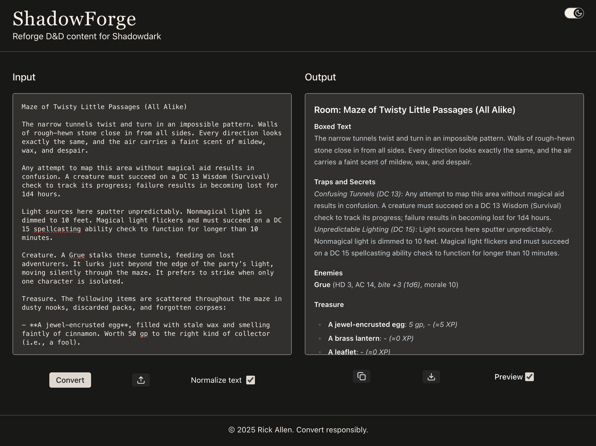

# ShadowForge

**Convert D&D 5e content to Shadowdark RPG using AI.**

ShadowForge is an AI-powered web app that helps Game Masters convert D&D 5e adventures — monster stats, treasure parcels, room descriptions, encounters — into [Shadowdark RPG](https://www.thearcanelibrary.com/pages/shadowdark) format. It handles the mechanical translation so the GM can focus on running the game.

Usage-limited [beta is live](https://shadow-forge-git-main-rickboots-projects.vercel.app/). Don't tell your friends yet.

---

## Features

- **Structured AI conversion** — content is parsed into semantic blocks, classified by type, and converted in parallel using structured LLM outputs (Zod-validated JSON)
- **Multi-provider LLM support** — OpenAI, Anthropic, DeepSeek, Groq; configurable per task role (classify vs. convert)
- **Shadowdark rule enforcement** — coin scaling (÷10), GP=XP, HD/AC/morale stat format, magic item balance warnings
- **Flexible input** — paste text directly or upload PDF/txt files
- **GM-ready markdown output** — boxed text, enemies, traps, treasure; copy or download
- **Markdown preview** — toggle between rendered preview and raw markdown

---

## How It Works

1. Paste or upload D&D 5e adventure text
2. ShadowForge sanitizes and parses it into content blocks
3. A fast/cheap LLM classifies each block (Room, Monster, Treasure, Lore, etc.)
4. Convertible blocks (Room, Encounter, Monster, NPC, Treasure, etc.) are sent in parallel to a capable LLM
5. Each block is returned as structured JSON and rendered to Shadowdark-formatted markdown

---

## Tech Stack

| Layer | Technology |
|-------|-----------|
| Frontend | Next.js 15, React 19, TypeScript, Tailwind CSS 4 |
| Backend | Next.js API Routes, Node.js |
| LLM | OpenAI SDK (OpenAI-compatible endpoints for DeepSeek, Groq) |
| Schema validation | Zod |
| File handling | pdfjs-dist (client-side PDF extraction) |
| 3D background | Three.js, React Three Fiber |
| Testing | Jest, ts-jest |
| Deployment | Vercel |

---

## Configuration

Set environment variables in `.env.local`:

```env
# Model for classification (cheap/fast recommended)
LLM_CLASSIFY_MODEL=openai-gpt-4o-mini

# Model for conversion (capable recommended)
LLM_CONVERT_MODEL=openai-gpt-4o

# API keys — only the key matching your chosen provider(s) is required
OPENAI_API_KEY=...
DEEPSEEK_API_KEY=...
GROQ_API_KEY=...
```

Available model keys: see `lib/llm/llmConfig.ts`.

---

## Conversion Rules

- **Economy**: all coin values divided by 10 (5e → Shadowdark scale)
- **XP**: 1 gp = 1 XP (added inline next to treasure)
- **Stat blocks**: HD, AC, attack roll + damage, morale score
- **Magic items**: +1/+2 included as-is; +3/legendary flagged with a GM balance warning
- **Traps & secrets**: mechanical traps and gameplay-affecting hidden elements only

---

## Project Structure

```
app/
  api/convert/route.ts      # POST endpoint — validates input, calls pipeline
  page.tsx                  # Main UI page
components/
  ShadowForgeLayout.tsx     # Input/output UI, file upload, preview toggle
  ThreeJsD20.tsx            # Animated 3D D20 background
lib/
  conversion/
    runPipeline.ts          # Unified pipeline: parse → classify → convert → render
    convertToBlocks.ts      # Splits text into header+paragraph blocks
    classifyWithLLM.ts      # Single LLM call to classify all blocks
    convertToShadowdark.ts  # Per-block structured LLM conversion
    renderToMarkdown.ts     # Pure renderer: ConvertedBlock[] → markdown string
    sanitizeText.ts         # OCR artifact removal, whitespace normalization
  llm/
    callLLMAPI.ts           # callLLMAPI() and callLLMStructured<T>() with timeout
    llmConfig.ts            # Model registry + role-based config (classify/convert)
    providers/              # OpenAI, DeepSeek, Groq (OpenAI-compatible)
  prompts/
    system/                 # classification.md, conversion.md — edit without touching code
    loadPrompt.ts           # Reads and caches .md prompt files at startup
  schemas/
    index.ts                # Zod schemas: ClassificationResponse, ConvertedBlock, etc.
__tests__/                  # Jest tests — schemas, renderer, pipeline, API route
```

---

## Running Locally

```bash
npm install
npm run dev
```

Open [http://localhost:3000](http://localhost:3000).

---

## Future Plans

- Semantic memory for context consistency across connected rooms
- User-editable conversion rule mappings (homebrew support)
- VTT integration (Foundry VTT, Fantasy Grounds)
- Adventure-level party scaling (monsters, traps, treasure)
- Automatic adventure generation
