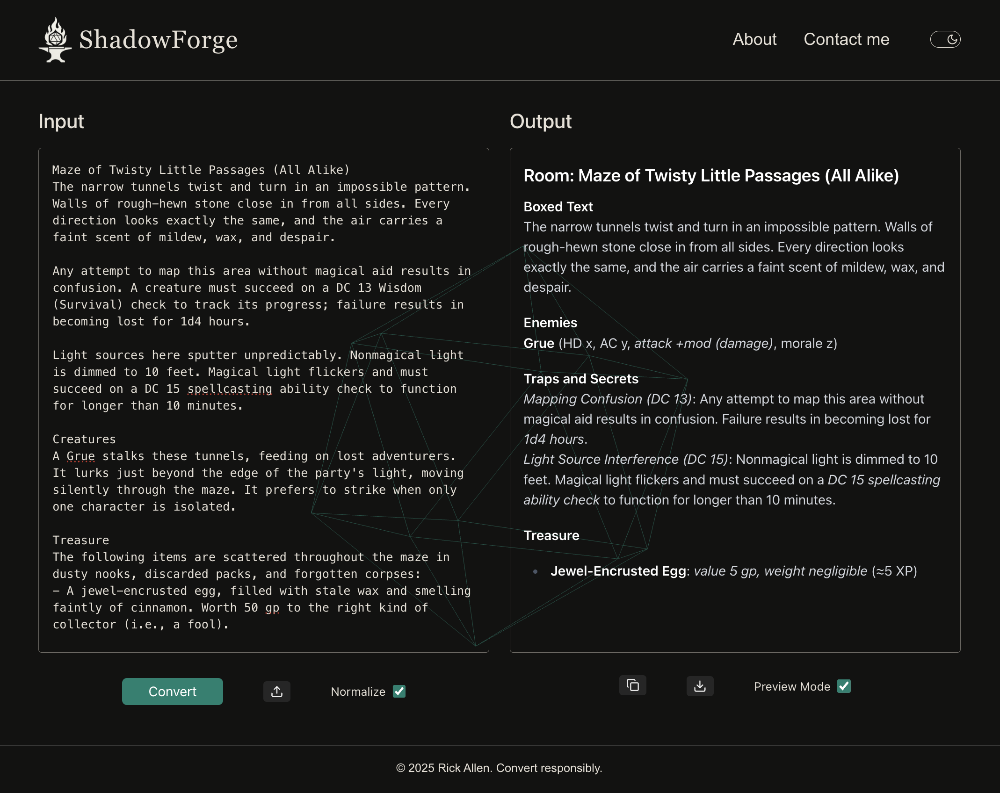

**Convert D&D 5e content to Shadowdark RPG using AI-powered tools.**

# ShadowForge

ShadowForge is an AI-powered, developer-friendly web app designed to help tabletop RPG game masters (GMs) convert Dungeons & Dragons 5e content into the gritty, old-school format of the Shadowdark RPG. It assists with transforming monster stats, treasure parcels, room descriptions, and rule mechanics (like skill checks) into formats suitable for direct use in Shadowdark games.

This tool addresses a common challenge faced by GMs wanting to use 5e adventures in Shadowdark: the conversion process is often slow, manual, and tedious, requiring constant referencing of multiple rulebooks. ShadowForge aims to make this process faster and easier, while ensuring the final creative decisions remain firmly in the hands of the GM.

_NOTE: The project is currently in the Minimum Viable Product (MVP) development stage; some features described below are planned or in progress._

**Features**

- **AI-Powered Conversion:** Uses LLMs (via LangChain + OpenAI API) to generate Shadowdark equivalents of 5e content.
- **Flexible Input:** Accepts direct text pasting or file uploads (PDF/DOCX).
- **Targeted Conversion:** Options to convert specific elements like **Monster Stats**, **Treasure Blocks** (adjusting for **Shadowdark economy/GP=XP**), **Encounters/Rooms** (including rule mechanics like **skill check DCs**), or generic text blocks.
- **Structured Prompts:** Leverages LangChain to route input to task-specific prompt templates that inject core Shadowdark design principles and rules for more accurate conversion.
- **GM-Friendly Output:** Results are formatted in markdown (e.g., using boxed text, clear headings, concise notes) designed for **easy readability and use by the GM at the table**.
- **Privacy First:** Uploaded content is processed ephemerally — never stored. _(Note: Kept from original README)_
- **Dual Output Modes:** (Planned) Option to generate both a GM version (with full details) and a player-facing version (e.g., read-aloud text only).
- **Original Text Preservation:** (Planned) Option to include the original 5e text alongside the conversion for easy comparison and reference.

**Example Use Case**

A GM uploads a DOCX file of a 5e dungeon module. ShadowForge extracts the text, normalizes it, and breaks it into manageable chunks based on room descriptions. The GM selects the "Encounter/Room Text" conversion option. ShadowForge processes each chunk, returning Shadowdark-ready room versions—complete with appropriate read-aloud text, simplified monster stats reflecting Shadowdark lethality, potential light-based traps or environmental effects, and relevant treasure parcels adjusted for a GP=XP system.

**Tech Stack & Pipeline**

- **Frontend:** Next.js, React, Tailwind CSS
- **Backend:** Node.js, Next.js API Routes
- **LLM Pipeline:** LangChain.js utilizing GPT-3.5 Turbo (chosen for favorable token limits and cost-efficiency).
- **File Handling:** Text extraction from PDF/DOCX uploads (using `pdf-parse`, `mammoth`), file uploads handled via `Formidable`.
- **Preprocessing:** Includes text normalization routines to improve content quality from potential OCR errors and ensure input consistency for the LLM.
- **Processing Strategy:** Implements input chunking to manage LLM context window limitations, allowing for the processing of large documents.
- **Development:** TypeScript, ESLint, Prettier
- **Deployment:** Vercel

**Prompt Strategy**

ShadowForge employs carefully engineered prompts designed to capture Shadowdark’s core gameplay principles:

- Stingy, loot-based economy (GP=XP focus)
- Low HP, high-tension encounters
- Emphasis on light/dark mechanics (integrated where appropriate)
- Classic fantasy tone

Each content type (monster, treasure, room) utilizes distinct `PromptTemplate`s within LangChain. These prompts were iteratively tested using content from official 5e modules (e.g., _Curse of Strahd_, _The Sunless Citadel_) to refine the output style, rules adherence, and overall pacing to feel appropriate for Shadowdark gameplay.

**File Structure**

```
shadowforge/
├── pages/                 # Next.js routes
│   ├── api/convert/       # API endpoints (text, file)
│   └── index.tsx          # Main UI
├── lib/                   # Core logic (conversion modules, file utils)
├── prompts/               # PromptTemplates for each conversion type
├── styles/                # Tailwind setup
├── public/                # Static assets
├── .env.example           # Example env vars
└── README.md
```

** Future Plans**

- Implement semantic memory for better context consistency between connected rooms or encounters.
- Develop full adventure chunking with automatic classification (Room vs. Lore vs. GM Guidance).
- Introduce user-editable conversion mappings for handling homebrew rules or custom preferences.
- Explore potential VTT integration (e.g., Fantasy Grounds, Foundry VTT).
